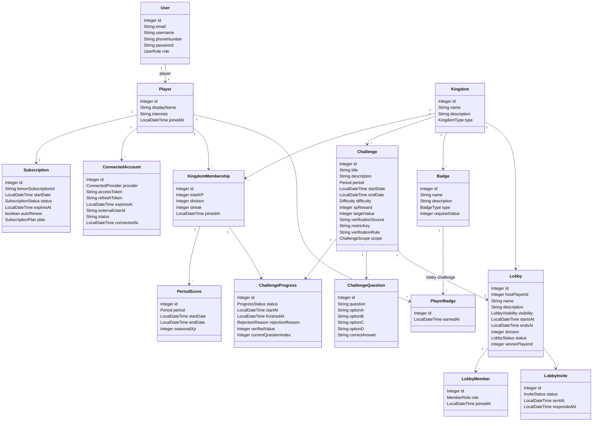
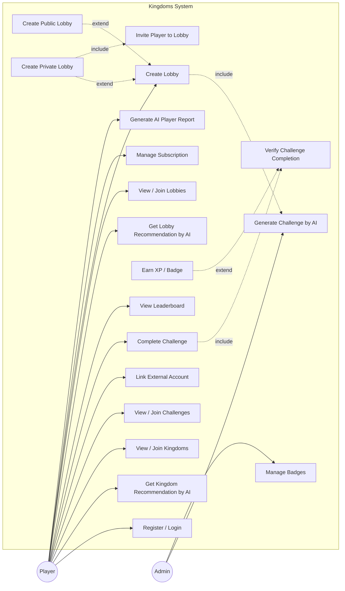

# Anas — Kingdom (الممالك) Modules

> Challenges, real verification, registration, and lobby resolution for a gamified Arabic-first self-improvement platform.

## Overview

**الممالك (Kingdom)** منصّة عربية لتطوير الذات بأسلوب الألعاب. ينضمّ اللاعب إلى **ممالك** متنوّعة (اللياقة، الصدقة، التطوّع، القراءة، الألعاب، الإيمان، المعرفة، التغذية، البرمجة)، ويخوض **تحدّيات يولّدها الذكاء الاصطناعي**، وعليه أن **يُثبت** إكمال كل تحدٍّ عبر تحقّق حقيقي — أنشطة Strava، أو تبرّعات بنكية عبر المصرفية المفتوحة (Neotek)، أو شهادات تطوّع يراجعها الذكاء الاصطناعي، أو اختبارات على واتساب، أو تحليل صور الوجبات، أو وقت اللعب والإنجازات على Steam، أو مساهمات GitHub. التحدّيات المُثبَتة تمنح **نقاط خبرة (XP)** ترفع **درجة اللاعب** (من D3 إلى D1) وتُكسبه **أوسمة**؛ كما **يتنافس اللاعبون في لوبيات** (يفتح اشتراك Premium عبر LemonSqueezy إنشاءها).

## My area: Challenges, Verification & Register

This subsystem is where a player **proves** their effort. It serves account **registration + WhatsApp OTP**, the **AI-generated challenges** (browse, join, complete), the full **verification stack** that turns a claim into XP — **Strava** fitness, **Neotek** Open-Banking charity donations, and **AI-reviewed volunteer PDFs** — plus **external-account linking** and the inbound **WhatsApp webhook** that routes PDFs, food photos, quiz answers and lobby-invite taps. It also closes a competition with the **lobby resolve**. Kingdoms owned here: **Fitness, Charity, Volunteer**.

## System class diagram

Describes the whole Kingdom system (15 entities), shared across the team; the modules in this README are Anas's.



## Use case diagram



## AI in Kingdom

Challenges are **AI-generated** per kingdom with **OpenAI (gpt-5.5)** via the Responses API and strict JSON output, de-duplicated against the kingdom's existing titles. AI also powers two of my verification paths — it **reviews the volunteer certificate PDF** (semantic match vs. the challenge) and **analyses the meal photo** for the nutrition check. XP is always awarded by **our** code, never the model, and every AI call has a **deterministic fallback** so the flow keeps working when the model is off.

## My endpoints

Base URL `http://localhost:8080`, all under `/api/v1`. Auth is HTTP Basic; 🔒 = admin-only.

### Register & verify — `/api/v1/auth`
| Method | Path | What it does |
| --- | --- | --- |
| POST | `/auth/register` | Create User + Player + memberships and send the WhatsApp OTP (public). |
| POST | `/auth/send-otp` | Resend the verification code to the logged-in user's phone. |
| POST | `/auth/verify-otp?code=` | Verify the OTP; activates the account and sends the welcome email. |

### Challenges — `/api/v1/challenge` · `/api/v1/challenge-progress`
| Method | Path | What it does |
| --- | --- | --- |
| GET | `/challenge/kingdom/{kingdomId}` | List a kingdom's challenges (browse-by-kingdom). |
| GET | `/challenge/difficulty/{difficulty}` | List challenges by difficulty. |
| GET | `/challenge/period/{period}` | List challenges by period (daily/weekly…). |
| POST | `/challenge/generate?kingdomId&difficulty&period` | 🔒 AI generates + saves a new challenge for a kingdom. |
| POST | `/challenge-progress/join/{challengeId}` | Join a challenge — starts a progress run. |
| POST | `/challenge-progress/finish/{id}` | Finish a run (triggers verification + XP). |
| POST | `/challenge-progress/cancel/{id}` | Cancel an in-progress run. |
| POST | `/challenge-progress/submit-image/{progressId}` | Submit a meal photo (`image` multipart) for AI analysis. |
| GET | `/challenge-progress/player` | The logged-in player's runs. |
| GET | `/challenge-progress/player/active` | The player's active runs. |
| GET | `/challenge-progress/player/status/{status}` | The player's runs by status. |

### Verify challenge completion — `/api/v1/verify`
| Method | Path | What it does |
| --- | --- | --- |
| GET | `/verify/fitness/connect` | Get the player's Strava authorize URL. |
| GET | `/verify/fitness/callback` | Strava OAuth redirect; stores the refresh token. |
| GET | `/verify/fitness/activities` | List the player's recent Strava activities. |
| GET | `/verify/fitness/check` | Check whether a fitness goal (distance/time/count) was reached. |
| POST | `/verify/charity/link` | Start Neotek bank consent; returns the authorize URL. |
| GET | `/verify/charity/accounts` | The player's linked bank accounts. |
| GET | `/verify/charity/transactions` | The player's bank transactions. |
| GET | `/verify/charity/check` | Check whether a qualifying donation was made. |
| POST | `/verify/charity/donate` | 🔒 Demo helper: record a simulated donation so a check can pass. |
| POST | `/verify/charity/manual-donate/{membershipId}/{challengeId}` | 🔒 Record a donation (SAR) for charity-lobby ranking. |
| POST | `/verify/volunteer/upload` | Upload a certificate PDF (`file`); AI verifies + completes the run. |

### Inbound WhatsApp & streaks — `/api/v1/verify` · `/api/v1/whatsapp`
| Method | Path | What it does |
| --- | --- | --- |
| POST | `/verify/volunteer/whatsapp` | Twilio webhook: routes PDF→volunteer, image→nutrition, قبول/رفض→invite, else→quiz answer (TwiML). |
| POST | `/whatsapp/webhook` | Inbound food-image webhook (async meal analysis, TwiML ack). |
| POST | `/verify/streak/run` | 🔒 Run the daily streak reset/warn pass now. |
| POST | `/verify/streak/warn/{playerId}/{kingdomId}` | 🔒 Send the "streak ends in 6 hours" WhatsApp warning. |

### External accounts — `/api/v1/connecte`
| Method | Path | What it does |
| --- | --- | --- |
| POST | `/connecte/link` | Link an external provider account (Strava, bank…) to the player. |
| GET | `/connecte/player` | The player's linked accounts (token-free). |
| DELETE | `/connecte/disconnect/{provider}` | Unlink a provider. |

### Resolve lobby — `/api/v1/lobby`
| Method | Path | What it does |
| --- | --- | --- |
| POST | `/lobby/finish/{lobbyId}/{winnerPlayerId}` | Close out a lobby competition and award the winner. |

## Tech stack

Java 17 · Spring Boot 4.0.6 · Spring Web · Spring Data JPA (Hibernate) · MySQL · Lombok · Maven · OpenAI (gpt-5.5) · Twilio (WhatsApp) · Mailtrap · Strava · Neotek Open Banking.

## Run it

```bash
# MySQL on localhost with a database named `Data`, then:
mvn spring-boot:run
```

- Base URL: `http://localhost:8080/api/v1`
- Provide secrets as env vars (or a git-ignored `src/main/resources/application-local.properties`): `OPENAI_API_KEY`, `TWILIO_ACCOUNT_SID`/`TWILIO_AUTH_TOKEN`, `MAILTRAP_API_TOKEN`, `STRAVA_*`, `NEOTEK_*`.
- For deployment set `SPRING_JPA_HIBERNATE_DDL_AUTO=update` and `DEMO_SEED_ENABLED=false`.

## Team

Graduation project — built by **Anas**, **Shahad**, and **Maysun**. The modules documented in this README belong to **Anas** (challenges, verification, register, lobby resolution — Fitness / Charity / Volunteer).
